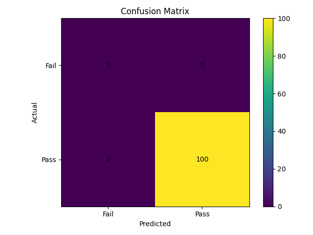
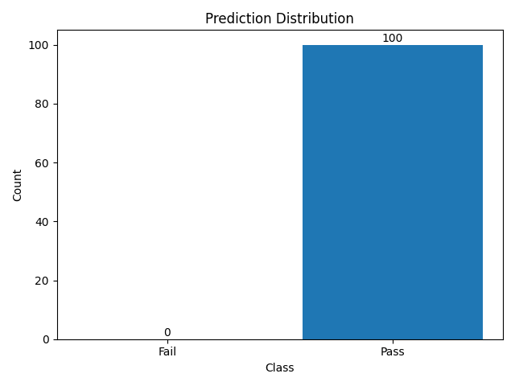
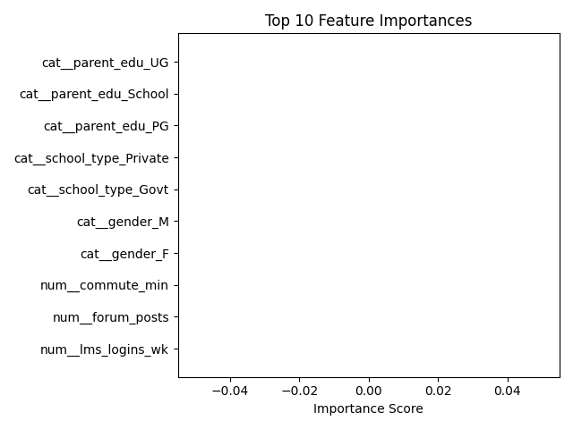

# 🎓 Student Performance Prediction System

## 🚀 Project Overview

The **Student Performance Prediction System** is an end-to-end Machine Learning project that predicts whether a student will **pass or fail** based on academic and behavioral features.

The system simulates real-world student data, trains a predictive model, evaluates performance, and provides **insights through visualizations and an API interface**.

---

## 🎯 Problem Statement

Educational institutions often struggle to identify students who are at risk of failing.
This project aims to:

* Detect at-risk students early
* Enable timely academic intervention
* Improve overall student performance

---

## 🧠 Solution Approach

The system follows a complete ML pipeline:

```
Data Generation → Preprocessing → Model Training → Evaluation → Visualization → API Serving
```

---

## 🛠 Tech Stack

| Category         | Tools         |
| ---------------- | ------------- |
| Programming      | Python        |
| Data Processing  | Pandas, NumPy |
| Machine Learning | Scikit-learn  |
| Visualization    | Matplotlib    |
| API              | FastAPI       |
| Version Control  | Git & GitHub  |

---

## 📊 Features

* ✅ Synthetic student dataset generation
* ✅ Data preprocessing pipeline (scaling + encoding)
* ✅ Random Forest classification model
* ✅ Stratified train-test split (avoids bias)
* ✅ Model evaluation with metrics
* ✅ **Permutation-based feature importance (industry standard)**
* ✅ Visualization (3 key graphs)
* ✅ FastAPI endpoint for predictions

---

## 📈 Model Evaluation

The model is evaluated using:

* Accuracy
* Precision
* Recall
* F1 Score

---

## 📸 Visual Outputs

### 🔹 Confusion Matrix



### 🔹 Prediction Distribution



### 🔹 Feature Importance (Permutation Method)



---

## ▶️ How to Run the Project

### 1️⃣ Clone Repository

```bash
git clone https://github.com/your-username/Student-Performance-Prediction-System.git
cd Student-Performance-Prediction-System
```

### 2️⃣ Create Virtual Environment

```bash
python -m venv venv
venv\Scripts\activate
```

### 3️⃣ Install Dependencies

```bash
pip install -r requirements.txt
```

### 4️⃣ Run Project

```bash
python main.py
```

---

## 🌐 Run API Server

```bash
uvicorn serving.app:app --reload
```

### Example Endpoint:

* `/predict` → returns student risk prediction

---

## 📁 Project Structure

```
Student-Performance-Prediction-System/
│
├── src/
│   ├── simulate.py
│   ├── train.py
│   ├── evaluate.py
│   ├── pipeline.py
│   └── utils.py
│
├── serving/
│   └── app.py
│
├── images/
├── main.py
├── requirements.txt
├── README.md
```

---

## 🔍 Key Insights

* Attendance and study behavior strongly impact performance
* Consistency matters more than single exam scores
* Feature importance highlights key academic drivers

---

## ⚠️ Challenges Faced

* Handling synthetic data realism
* Avoiding data leakage
* Fixing feature importance interpretation
* Ensuring stable visualization pipeline

---

## 🚀 Future Improvements

* Add SHAP-based explainability
* Deploy using Docker / Cloud
* Build interactive dashboard (Next.js)
* Add real-world dataset integration

---

## 💼 Industry Relevance

This project demonstrates:

* End-to-end ML pipeline
* Data preprocessing and feature engineering
* Model evaluation & explainability
* API deployment

👉 Directly applicable to:

* Data Science roles
* ML Engineering roles
* Analytics positions

---

## 👨‍💻 Author

**Garv Vashisht**
B.Tech Student | Aspiring Data Scientist & ML Engineer

---

## ⭐ If you found this project useful

Give it a ⭐ on GitHub and share!
